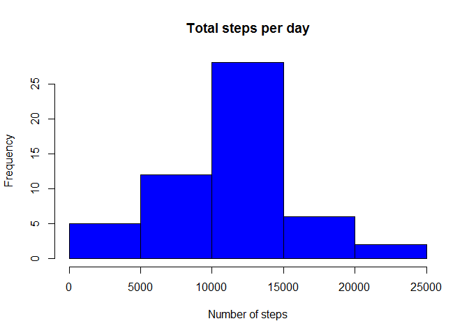
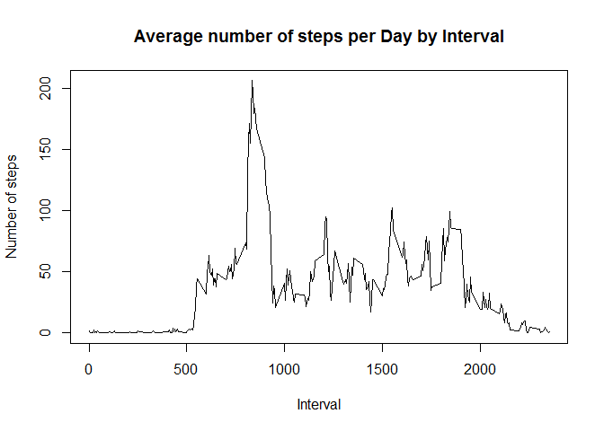
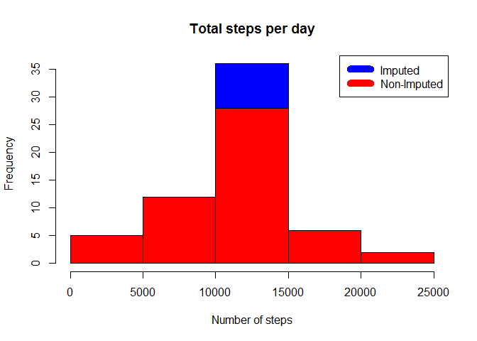
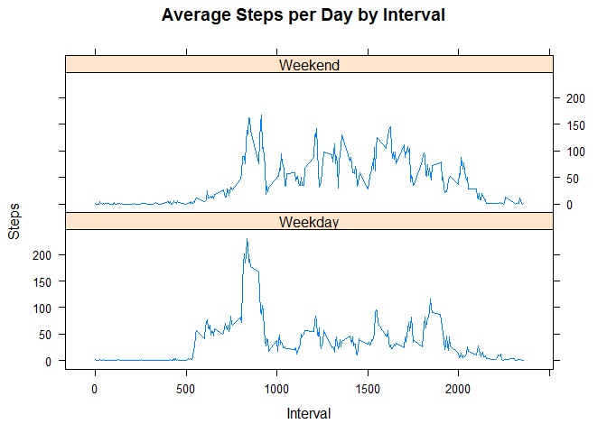

# Reproducible Research: Peer Assessment 1


## Loading and preprocessing the data

```r
#Unzip and load data as csv
data <- read.csv(unzip("activity.zip","activity.csv"))
```

## What is mean total number of steps taken per day?

```r
#Sum steps per day and calculating mean/median. Presentation as histogram
steps_per_day <- aggregate(steps ~ date, data, sum)
hist(steps_per_day$steps, main = paste("Total steps per day"), col="blue", xlab="Number of steps")
```

<!-- -->

```r
rmean <- mean(steps_per_day$steps)
rmedian <- median(steps_per_day$steps)
```
The mean is 1.0766189\times 10^{4} and the median is 10765.

## What is the average daily activity pattern?

```r
#Calculation of average steps for each interval for all days and presentation as #plot Extract max average
steps_per_interval <- aggregate(steps ~ interval, data, mean)

plot(steps_per_interval$interval, steps_per_interval$steps, type="l", xlab="Interval", ylab="Number of steps", main="Average number of steps per Day by Interval")
```

<!-- -->

```r
max_interval <- steps_per_interval[which.max(steps_per_interval$steps),]
```

The 5-minute interval on average across all days has the maximum number of steps by 835, 206.1698113.

## Imputing missing values

```r
#Calculate missing values
sum(is.na(data$steps))
```

```
## [1] 2304
```

```r
#Filling up missing values with the mean for a 5-minutes interval and creating new dataset with filled up missing values
data_impute <- data
nas <- is.na(data_impute$steps)

avg_interval <- round(tapply(data_impute$steps, data_impute$interval, mean, na.rm=TRUE, simplify = TRUE))
data_impute$steps[nas] <-avg_interval[as.character(data_impute$interval[nas])]

#Creation of histogram of the total number of steps and calculation of the mean and median total number of steps per day
steps_per_day_i <- aggregate(steps ~ date, data_impute, sum)
head(steps_per_day_i,5)
```

```
##         date steps
## 1 2012-10-01 10762
## 2 2012-10-02   126
## 3 2012-10-03 11352
## 4 2012-10-04 12116
## 5 2012-10-05 13294
```

```r
hist(steps_per_day_i$steps, main=paste("Total steps per day"), col="blue", xlab="Number of steps")
hist(steps_per_day$steps, main=paste("Total steps per day"), col="red", xlab="Number of steps", add=T)
legend("topright", c("Imputed","Non-Imputed"), col=c("blue","red"), lwd=10)
```

<!-- -->

```r
rmean <-mean(steps_per_day_i$steps)
rmedian <-median(steps_per_day_i$steps)
head(data_impute, 5)
```

```
##   steps       date interval
## 1     2 2012-10-01        0
## 2     0 2012-10-01        5
## 3     0 2012-10-01       10
## 4     0 2012-10-01       15
## 5     0 2012-10-01       20
```
The mean is 1.0765639\times 10^{4} and the median is 1.0762\times 10^{4}.

## Are there differences in activity patterns between weekdays and weekends?

```r
Sys.setlocale("LC_TIME","C")
```

```
## [1] "C"
```

```r
data_impute <- data_impute

weekdays <- c("Monday","Tuesday","Wednesday", "Thursday", "Friday")

data_impute$daytype = as.factor(ifelse(is.element(weekdays(as.Date(data_impute$date)),weekdays),"Weekday","Weekend"))
str(data_impute)
```

```
## 'data.frame':	17568 obs. of  4 variables:
##  $ steps   : num  2 0 0 0 0 2 1 1 0 1 ...
##  $ date    : Factor w/ 61 levels "2012-10-01","2012-10-02",..: 1 1 1 1 1 1 1 1 1 1 ...
##  $ interval: int  0 5 10 15 20 25 30 35 40 45 ...
##  $ daytype : Factor w/ 2 levels "Weekday","Weekend": 1 1 1 1 1 1 1 1 1 1 ...
```

```r
library(lattice)
#panel plot 
steps_per_interval_i2 <- aggregate(steps ~ interval + daytype,data_impute,mean)


xyplot(steps_per_interval_i2$steps ~ steps_per_interval_i2$interval|steps_per_interval_i2$daytype, main="Average Steps per Day by Interval", xlab="Interval", ylab="Steps", layout=c(1,2), type="l")
```

<!-- -->
